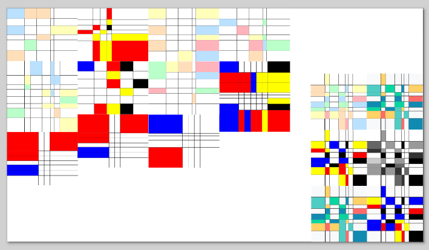

# 🎨 Mondrian Grid Generator for Inkscape

[](https://inkscape.org)
[](https://python.org)
[](LICENSE)

Generate compositions in the style of **Piet Mondrian** directly in Inkscape!



## ✨ Features

- **Authentic Mondrian-style** compositions with controlled randomness
- **Multiple color palettes**: Classic, Modern, Grayscale, Primary, Pastel
- **Advanced composition control**: Distribution, Balance, Randomness sliders
- **Fully customizable**: Canvas size, grid density, line thickness, margins
- **Reproducible results**: Random seed support
- **Clean output**: Optional grouping and background

## 🚀 Quick Install

### Method 1: Direct Download
1. Download the latest release: [mondrian-grid.zip](https://github.com/yusdesign/mondrian-grid/releases)
2. Extract and copy `mondriangrid.inx` and `mondriangrid.py` to:
   - **Windows**: `%APPDATA%\inkscape\extensions\`
   - **Linux**: `~/.config/inkscape/extensions/`
   - **macOS**: `~/Library/Application Support/inkscape/extensions/`
3. Restart Inkscape

### Method 2: From Source
```bash
git clone https://github.com/yusdesign/mondrian-grid-generator.git
cd mondrian-grid-generator/extension
cp mondriangrid.* ~/.config/inkscape/extensions/

📖 Usage

    Open Inkscape

    Go to Extensions → Render → Mondrian Grid Generator

    Adjust parameters:

        Canvas: Set width and height

        Grid: Lines, thickness, margin

        Colors: Palette and density

        Composition: Distribution, Balance, Randomness

        Advanced: Random seed, grouping options

    Click Apply

🎨 Parameters Explained
Canvas Settings

    Width/Height: Dimensions of the generated composition

    Margin: Space from edges (prevents lines at borders)

Grid Settings

    Vertical/Horizontal Lines: Number of grid divisions

    Line Thickness: Thickness of black grid lines

    Margin: Space from edges

Color Settings

    Color Palette: Choose from 5 different palettes

    Color Density: Percentage of rectangles to color

Composition Control

    Distribution: Controls line placement (0=Random, 1=Structured)

    Balance: Controls color placement (0=Random, 1=Strategic)

    Randomness: Additional randomness in line placement

Advanced

    Random Seed: 0 for random, any number for reproducible results

    Minimum Rectangle Size: Skip coloring very small rectangles

    Group Elements: Group all generated elements together

    Add Background: Add white background rectangle

    Vary Line Thickness: Randomize line thickness slightly

🖼️ Examples
Classic Mondrian	Modern Composition	Chaotic Abstract
https://screenshots/classic.png	https://screenshots/modern.png	https://screenshots/chaotic.png

Example Settings:

    Classic: Distribution=0.8, Balance=0.8, Palette=classic

    Modern: Distribution=0.6, Balance=0.5, Palette=modern

    Chaotic: Distribution=0.3, Balance=0.2, Randomness=0.3

🛠️ Development
Project Structure
text

extension/
├── mondriangrid.py      # Main Python extension
├── mondriangrid.inx     # Extension definition (GUI)
└── icon.svg            # Optional icon

Requirements

    Inkscape 1.0+ (tested with 1.4.3)

    Python 3.6+ (bundled with Inkscape)

    inkex module (bundled with Inkscape)

Building from Source
bash

# Clone repository
git clone https://github.com/yusdesign/mondrian-grid-generator.git

# Install for development
cd mondrian-grid-generator
./install-local.sh

🤝 Contributing

Contributions are welcome! Here's how:

    Fork the repository

    Create a feature branch: git checkout -b feature/amazing-feature

    Make your changes

    Test thoroughly

    Submit a pull request

Ideas for Contributions

    Add new color palettes

    Implement different composition algorithms

    Add preview functionality

    Create preset configurations

    Improve performance for large grids

    Add export options (patterns, swatches)

📄 License

This project is licensed under the GPL-2.0-or-later - see the LICENSE file for details.

Compatible with Inkscape's extension licensing requirements.
🙏 Acknowledgments

    Inspired by Piet Mondrian's Neo-plasticism

    Built for the amazing Inkscape community

    Thanks to all contributors and testers

📞 Support

    Issues: GitHub Issues

    Discussions: GitHub Discussions

    Inkscape Forum: Extension Development

"The position of the artist is humble. He is essentially a channel."
— Piet Mondrian
